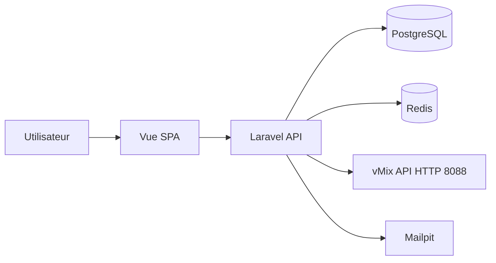
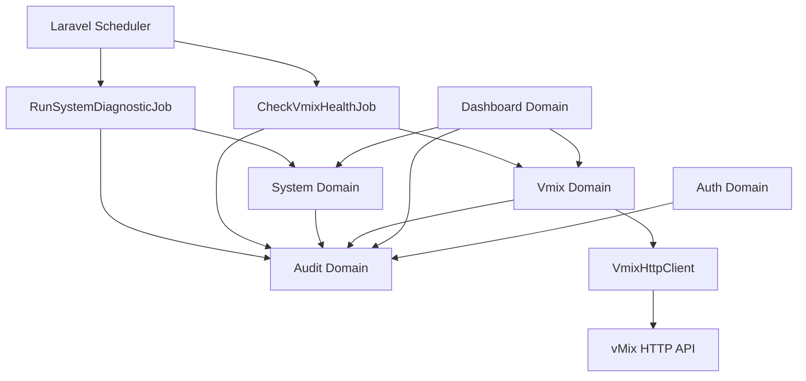
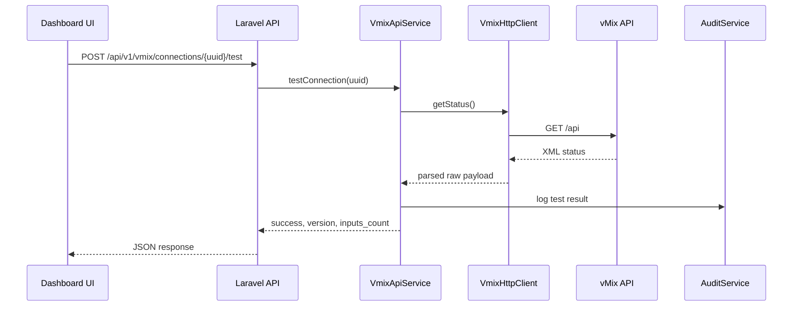
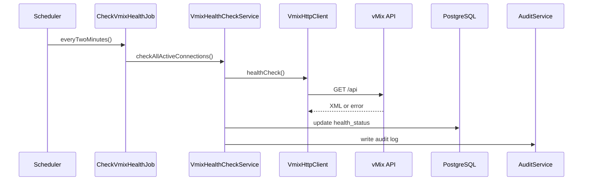
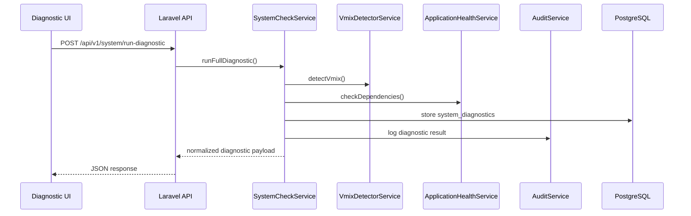

# Phase 0 - Foundation & Validation vMix

## 1. Objet de la phase

Cette phase ne couvre pas encore les modules metier `Media`, `Scheduling` ou `Live`.

Le but est de valider la chaine technique complete:

`Laravel -> API HTTP vMix -> parsing XML -> reponse JSON -> audit -> dashboard`

La phase 0 est reussie uniquement si la plateforme peut:

- demarrer dans Docker sans erreur
- authentifier un utilisateur
- enregistrer une connexion vMix
- tester reellement `http://localhost:8088/api`
- parser les informations critiques renvoyees par vMix
- afficher l'etat dans le dashboard
- executer un health check automatise
- journaliser les succes et erreurs

## 2. Perimetre fonctionnel

### Inclus

- fondations Docker
- bootstrap Laravel 12
- bootstrap Vue 3
- domaine `Auth`
- domaine `Dashboard`
- domaine `Vmix`
- domaine `Audit`
- domaine `System`
- endpoint de test de connexion vMix
- widget dashboard d'etat vMix
- page de diagnostic systeme
- scheduler de health check
- abstraction vMix real/mock
- preparation du modele de licence
- tests unitaires et feature

### Exclus

- bibliotheque media
- grille de programmation
- detection de conflits
- pilotage live
- automatisation de diffusion

## 3. Arborescence cible

```text
balafon-tv-automation/
  app/
    Domains/
      Auth/
        DTOs/
        Models/
        Repositories/
        Services/
      Dashboard/
        DTOs/
        Queries/
        Services/
      Vmix/
        Clients/
          VmixHttpClient.php
        DTOs/
          VmixInputDTO.php
          VmixStatusDTO.php
        Models/
          VmixConnection.php
          VmixCommandLog.php
        Providers/
          Contracts/
            VmixProviderInterface.php
          MockVmixProvider.php
          RealVmixProvider.php
        Repositories/
          Contracts/
            VmixConnectionRepositoryInterface.php
          EloquentVmixConnectionRepository.php
        Services/
          VmixApiService.php
          VmixHealthCheckService.php
      Audit/
        DTOs/
        Models/
          AuditLog.php
        Repositories/
        Services/
          AuditService.php
      System/
        DTOs/
        Models/
          License.php
          SystemDiagnostic.php
        Repositories/
          Contracts/
            LicenseRepositoryInterface.php
        Services/
          ApplicationHealthService.php
          CpuHealthService.php
          DiskHealthService.php
          EnvironmentValidatorService.php
          LicenseService.php
          MemoryHealthService.php
          SystemCheckService.php
          VmixDetectorService.php
    Http/
      Controllers/
        Api/
          V1/
            Auth/
            Dashboard/
            System/
            Vmix/
      Requests/
      Resources/
    Jobs/
      CheckVmixHealthJob.php
      RunSystemDiagnosticJob.php
    Console/
      Commands/
    Providers/
  bootstrap/
  config/
  database/
    factories/
    migrations/
    seeders/
      AdminUserSeeder.php
      RoleSeeder.php
      VmixConnectionSeeder.php
      DatabaseSeeder.php
  docker/
    nginx/
      default.conf
      Dockerfile
    php/
      Dockerfile
      php.ini
      xdebug.ini
  public/
  resources/
    js/
      app/
        core/
          api/
          router/
          stores/
          layouts/
        modules/
          auth/
          dashboard/
          vmix/
        ui/
      bootstrap.js
      main.js
    css/
      app.css
  routes/
    api.php
    web.php
    console.php
  tests/
    Feature/
      Auth/
      Vmix/
    Unit/
      Domains/
        Vmix/
    Architecture/
  docker-compose.yml
  README.md
```

## 4. Decisions d'architecture

### 4.1 Structure backend

- DDD legere par domaine dans `app/Domains`
- logique d'orchestration dans les services
- acces DB via repositories
- controllers tres fins
- DTOs pour stabiliser les contrats metier cote vMix

### 4.2 Structure frontend

- SPA Vue 3 servie par Vite
- PrimeVue pour composants riches
- TailwindCSS pour layout et theme
- Pinia pour session et etat dashboard
- polling 30 secondes pour widget vMix

### 4.3 Strategie vMix

- une connexion `vMix local` seedee par defaut
- consommation de l'endpoint XML `/api`
- parsing defensif du XML
- encapsulation totale dans `VmixHttpClient`
- aucun appel direct a vMix depuis les controllers
- toute interaction metier passe par `VmixProviderInterface`
- `RealVmixProvider` pilote un vMix reel
- `MockVmixProvider` permet demos et tests sans vMix installe
- le provider actif doit etre configurable par environnement

### 4.3 bis Interfaces critiques

Les services critiques doivent dependre d'interfaces:

- `VmixProviderInterface`
- `NotificationProviderInterface`
- `StorageProviderInterface`

Dans cette phase:

- `VmixProviderInterface` sera implemente et branche
- `NotificationProviderInterface` sera preparee comme contrat pour les phases futures
- `StorageProviderInterface` sera preparee comme contrat pour les phases futures

### 4.4 Strategie audit

- audit metier simple, synchrone au debut
- journalisation de:
  - connexion utilisateur
  - test manuel vMix
  - erreurs de health check
  - succes de health check
  - diagnostics systeme
  - commandes vMix de validation
  - erreurs systeme

### 4.5 Strategie produit installable

- architecture pensee des maintenant pour plusieurs postes Windows
- diagnostic pre-installation et post-installation expose en API
- detection des prerequis locaux des la phase 0
- isolation de toute logique OS-specifique dans le domaine `System`
- preparation d'une future couche setup `BalafonBroadcastSetup.exe` sans couplage avec l'UI admin
- preparation d'un futur packaging Electron pour exploitation desktop

## 5. Diagramme de contexte



## 6. Diagramme de composants



## 7. Diagramme de sequence - test manuel vMix



## 8. Diagramme de sequence - health check automatique



## 9. Diagramme de sequence - diagnostic systeme



## 10. Modele de donnees de la phase 0

### users

- id
- name
- email
- password
- is_active
- last_login_at nullable
- timestamps

### roles

- id
- name
- code
- timestamps

### role_user

- user_id
- role_id

### vmix_connections

- id
- uuid
- name
- host
- port
- api_password nullable
- timeout_ms
- health_status
- last_health_check_at nullable
- is_active
- timestamps

### licenses

- id
- uuid
- license_key nullable
- license_type nullable
- customer_name nullable
- customer_email nullable
- machine_fingerprint nullable
- activated_at nullable
- expires_at nullable
- status
- metadata jsonb
- created_at
- updated_at

### vmix_command_logs

- id
- uuid
- vmix_connection_id
- command_name
- command_url
- request_payload jsonb nullable
- response_code nullable
- response_body text nullable
- status
- executed_at
- created_at
- updated_at

### system_diagnostics

- id
- uuid
- machine_name nullable
- os_name
- os_version nullable
- vmix_detected
- vmix_version nullable
- vmix_api_reachable
- tested_endpoints jsonb
- local_ip nullable
- total_disk_bytes nullable
- free_disk_bytes nullable
- total_memory_bytes nullable
- available_memory_bytes nullable
- cpu_cores nullable
- cpu_load_percent nullable
- postgres_ok
- redis_ok
- scheduler_ok
- queue_workers_ok
- context jsonb
- checked_at
- created_at
- updated_at

### audit_logs

- id
- uuid
- actor_id nullable
- actor_type
- action
- entity_type
- entity_id nullable
- context jsonb
- ip_address nullable
- user_agent nullable
- created_at

## 11. Contrats API initiaux

### Auth

- `POST /api/v1/auth/login`
- `POST /api/v1/auth/logout`
- `GET /api/v1/auth/me`

### Dashboard

- `GET /api/v1/dashboard/summary`
- `GET /api/v1/dashboard/vmix-status`
- `GET /api/v1/dashboard/system-status`

### System

- `GET /api/v1/system/check`
- `GET /api/v1/system/requirements`
- `GET /api/v1/system/health`
- `GET /api/v1/system/vmix`
- `POST /api/v1/system/run-diagnostic`

### vMix

- `GET /api/v1/vmix/status`
- `GET /api/v1/vmix/inputs`
- `GET /api/v1/vmix/connections`
- `POST /api/v1/vmix/connections`
- `POST /api/v1/vmix/connections/{uuid}/test`
- `GET /api/v1/vmix/connections/{uuid}/status`
- `POST /api/v1/vmix/play-test`

## 12. Contrat de reponse du test vMix

Succes minimal attendu:

```json
{
  "success": true,
  "version": "29.x",
  "inputs_count": 5
}
```

Erreur minimale attendue:

```json
{
  "success": false,
  "message": "Unable to connect to vMix API"
}
```

## 13. Contrat de reponse du diagnostic systeme

```json
{
  "success": true,
  "os": {
    "name": "Windows 11",
    "version": "10.0.x"
  },
  "vmix": {
    "detected": true,
    "version": "29.x",
    "api_reachable": true,
    "inputs_count": 5
  },
  "resources": {
    "disk": {
      "total_bytes": 0,
      "free_bytes": 0
    },
    "memory": {
      "total_bytes": 0,
      "available_bytes": 0
    },
    "cpu": {
      "cores": 8,
      "load_percent": 15.2
    }
  },
  "application": {
    "postgres_ok": true,
    "redis_ok": true,
    "scheduler_ok": true,
    "queue_workers_ok": false
  }
}
```

## 14. Parsing XML vMix

La phase 0 doit extraire au minimum:

- `version`
- etat de streaming
- liste des inputs
- nombre d'inputs
- etat global general

Approche recommandee:

- `Http::timeout(...)->get($url)`
- validation du code HTTP
- parsing via `simplexml_load_string`
- mapping vers `VmixStatusDTO` et `VmixInputDTO`
- gestion stricte des erreurs XML invalides

## 15. Compatibilite Windows + Docker + vMix

Le point de vigilance majeur est la resolution reseau:

- depuis Windows hote, vMix repond sur `localhost:8088`
- depuis le conteneur PHP, `localhost` cible le conteneur lui-meme
- il faudra donc tester dans cet ordre:
  1. `http://localhost:8088/api`
  2. `http://127.0.0.1:8088/api`
  3. `http://host.docker.internal:8088/api`
  4. toute adresse explicitement configuree en base

Decision recommandee:

- stocker `host`, `port` et timeout de facon editable
- fournir une logique de fallback centralisee dans `VmixDetectorService`
- separer les tests "API reachable from app" et "vMix installed on host"

## 16. Plan d'implementation detaille

### Etape 1 - Foundation repo

- initialiser Laravel 12
- installer Sanctum
- preparer PostgreSQL, Redis, queue et scheduler
- brancher Vite + Vue 3 + PrimeVue + Tailwind + Pinia + Router

### Etape 2 - Docker local

- creer `docker-compose.yml`
- creer Dockerfile PHP-FPM
- creer config Nginx
- brancher Mailpit
- verifier ports 8080, 5173, 5432, 6379, 8025

### Etape 3 - Domaine Auth

- creer `User`
- creer `Role`
- migrations et seeders
- auth API Sanctum
- seed admin

### Etape 4 - Domaine Audit

- migration `audit_logs`
- `AuditLog` model
- `AuditService`
- hooks de journalisation pour login et vMix

### Etape 5 - Domaine System

- migration `system_diagnostics`
- migration `licenses`
- model `SystemDiagnostic`
- model `License`
- `SystemCheckService`
- `EnvironmentValidatorService`
- `VmixDetectorService`
- `DiskHealthService`
- `MemoryHealthService`
- `CpuHealthService`
- `ApplicationHealthService`
- `LicenseService`
- endpoints systeme

### Etape 6 - Domaine Vmix

- migration `vmix_connections`
- migration `vmix_command_logs`
- seeder connexion locale
- model `VmixConnection`
- repository et interface
- `VmixProviderInterface`
- `RealVmixProvider`
- `MockVmixProvider`
- `VmixHttpClient`
- `VmixApiService`
- `VmixHealthCheckService`

### Etape 7 - API vMix

- endpoint `POST /api/v1/vmix/connections/{uuid}/test`
- endpoint `GET /api/v1/vmix/connections/{uuid}/status`
- endpoint `GET /api/v1/vmix/status`
- endpoint `GET /api/v1/vmix/inputs`
- endpoint `POST /api/v1/vmix/play-test`
- validations et ressources JSON

### Etape 8 - Dashboard

- layout principal SaaS
- page login
- page dashboard
- page `System > Diagnostic`
- widget etat vMix
- widget etat systeme
- derniers audits
- derniers tests vMix
- polling 30 secondes

### Etape 9 - Scheduler

- `CheckVmixHealthJob`
- `RunSystemDiagnosticJob`
- planification toutes les 2 minutes
- `withoutOverlapping()`
- locks Redis
- mise a jour `health_status`

### Etape 10 - Tests

- unit tests sur client et services vMix
- unit tests sur services systeme
- feature tests sur endpoints Auth et vMix
- feature tests sur endpoints systeme
- mocks HTTP

## 17. Ordre d'ecriture du code

1. Docker
2. Bootstrap Laravel
3. Bootstrap Vue
4. Migrations Auth + Audit + System + Vmix
5. Seeders
6. Domaine System
7. Domaine Vmix
8. Auth API
9. Dashboard UI
10. Scheduler
11. Tests

Cet ordre evite de developper l'UI avant d'avoir une base contractuelle stable cote backend.

## 18. Risques techniques

### 15.1 Risques vMix

- XML variable selon la version exacte de vMix
- indisponibilite locale de `localhost:8088`
- timeouts ou reponses partielles
- commandes futures non homogènes selon le setup

### 15.1 bis Risques systeme Windows

- detection OS variable selon les commandes disponibles
- collecte CPU/RAM/disque dependante du contexte conteneur vs hote
- certaines informations systeme de l'hote Windows ne sont pas visibles depuis Linux Docker

Decision:

- distinguer clairement `diagnostic application dans Docker` et `diagnostic machine hote`
- preparer des abstractions pour une future sonde Windows ou agent local si necessaire
- garder Electron hors de la chaine critique backend

### 15.2 Risques Docker sur Windows

- collisions de ports 8080 ou 5432
- partage de volumes lent sous Windows
- resolution `localhost` differente entre conteneur et machine hote

### 15.3 Risques de connectivite

Si Laravel tourne en conteneur, `localhost` dans le conteneur ne pointe pas vers vMix sur l'hote Windows.

Consequence:

- il faudra probablement utiliser `host.docker.internal:8088` cote Docker
- tout en gardant `localhost:8088` pour un test hors conteneur

Ce point doit etre traite explicitement dans la config.

### 15.5 Risques produit multi-installation

- forte dependance aux chemins et prerequis locaux Windows
- besoin futur d'un installateur ou agent pour les diagnostics machine reels
- risque de confusion entre application SaaS locale et appliance broadcast

Il faut donc garder une architecture portable et parametrable des maintenant.

### 15.6 Risques de scheduler

- scheduler non lance en local
- jobs simultanes
- mauvais suivi des echecs silencieux

## 19. Strategie de validation

### Validation manuelle

1. demarrer Docker
2. ouvrir l'application sur `http://localhost:8080`
3. se connecter avec l'admin seedee
4. verifier la presence de la connexion `vMix local`
5. cliquer sur `Tester la connexion`
6. verifier le retour JSON
7. verifier le widget dashboard
8. verifier l'ecriture dans `audit_logs`
9. verifier la page `System > Diagnostic`
10. verifier qu'un `Play Test` journalise bien une commande vMix

### Validation automatique

- tests unitaires du parsing XML
- tests unitaires du mapping DTO
- tests feature du endpoint `/test`
- tests feature des endpoints systeme
- tests feature de securisation auth

## 20. Strategie recommandee

La strategie la plus solide pour cette phase est:

1. construire d'abord un noyau backend testable autour de vMix
2. construire en parallele un diagnostic systeme orienté produit installable
3. valider tres tot la connectivite reelle vers vMix
4. ensuite brancher le dashboard sur ces endpoints
5. enfin ajouter scheduler et audit automatise

Le point critique n'est pas l'UI. Le point critique est la realite de la communication entre le conteneur Laravel et vMix sur Windows.

## 21. Verification de la strategie actuelle

L'architecture actuelle documentee reste coherente, mais doit etre etendue de la facon suivante:

- ajout du domaine `System`
- ajout des tables `vmix_command_logs` et `system_diagnostics`
- ajout d'une page `System > Diagnostic`
- ajout d'un job `RunSystemDiagnosticJob`
- ajout d'une logique produit "multi-postes Windows" dans les decisions techniques

Le reste de la strategie phase 0 demeure valide.

## 22. Definition de done

La phase 0 est terminee seulement si:

- Docker demarre
- Laravel repond
- Vue repond
- login fonctionne
- la connexion vMix locale est seedee
- le test manuel de connexion fonctionne
- la version vMix remonte correctement
- le nombre d'inputs remonte correctement
- le diagnostic systeme fonctionne
- vMix est detecte ou son absence est correctement remontee
- le dashboard affiche l'etat vMix
- le dashboard affiche l'etat systeme
- le scheduler execute le health check
- le scheduler execute le diagnostic systeme
- les succes et erreurs sont traces dans `audit_logs`
- le `Play Test` declenche une action vMix reelle ou une erreur exploitable journalisee

## 23. Decision immediate

La strategie est validee si on retient ces choix:

- domaines limites a `Auth`, `Dashboard`, `Vmix`, `Audit`, `System`
- vMix traite comme integration critique isolee
- parsing XML au coeur du backend
- audit des actions techniques des la phase 0
- verification explicite de `host.docker.internal` pour joindre vMix depuis Docker
- conception orientee produit installable sur plusieurs postes Windows
- abstraction provider pour permettre un fonctionnement reel ou mocke sans vMix installe

Une fois cette validation acceptee, on peut lancer l'implementation du squelette technique de la phase 0.
