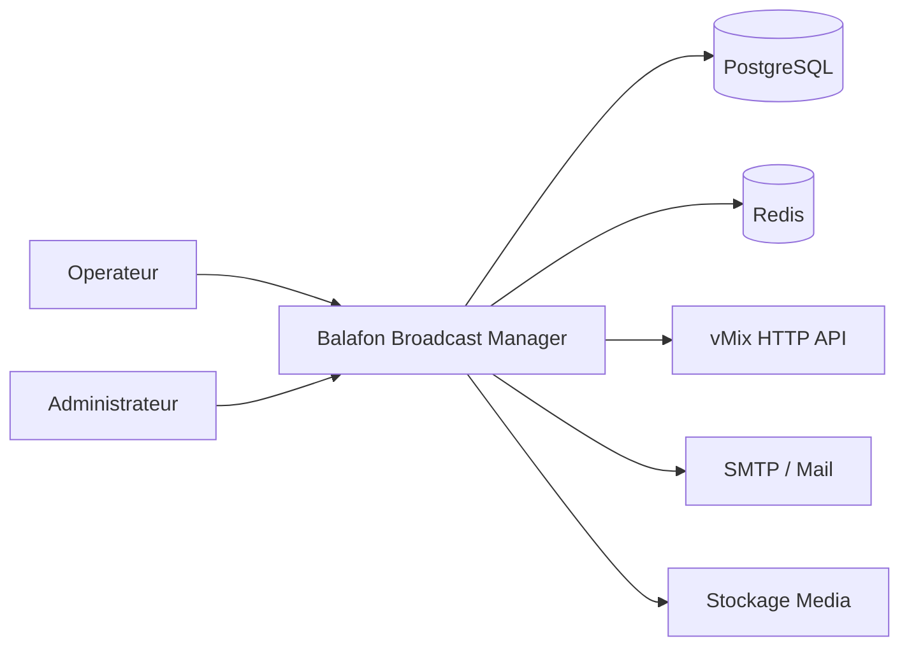
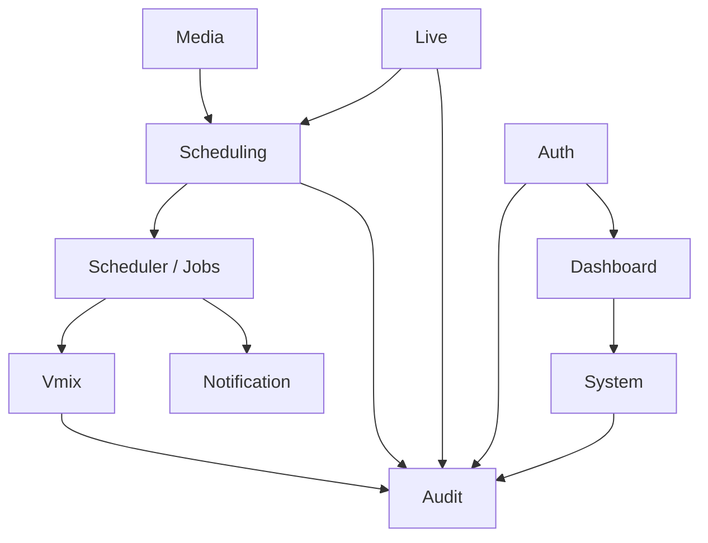
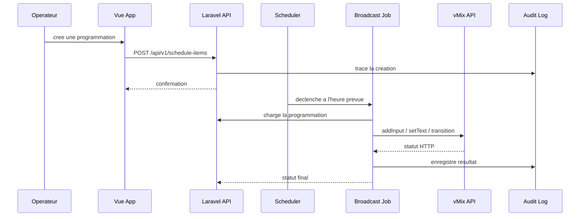
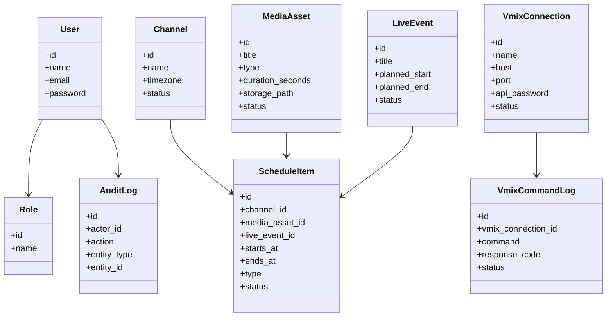

# Balafon Broadcast Manager - Architecture POC

## 1. Vision

Balafon Broadcast Manager est une plateforme web de planification TV et de pilotage d'un moteur de diffusion vMix via son API HTTP.

Le POC doit permettre de:

- gerer les utilisateurs et leurs droits
- centraliser des medias exploitables a l'antenne
- construire une grille TV planifiee
- preparer et declencher des lives
- dialoguer avec vMix pour charger, lancer et superviser la diffusion
- automatiser les transitions via Laravel Scheduler
- notifier les operateurs
- journaliser toutes les actions critiques

## 2. Principes d'architecture

### Stack

- Backend: Laravel 12, PHP 8.4
- Frontend: Vue 3, PrimeVue, TailwindCSS
- Base de donnees: PostgreSQL
- Cache / queues / locks: Redis
- Environnement local: Docker

### Choix structurants

- DDD legere: decoupage par domaines metier sans sur-ingenierie
- Architecture modulaire de type `app/Domains/*`
- Services applicatifs pour l'orchestration
- Repositories pour isoler l'acces aux donnees
- Providers contractuels pour les integrations remplacables
- Jobs, Events, Listeners pour l'automatisation
- API REST versionnee `api/v1`
- Journalisation technique et metier differenciee

## 3. Structure cible du projet

```text
app/
  Domains/
    Auth/
      Actions/
      DTOs/
      Models/
      Providers/
      Repositories/
      Services/
    Dashboard/
      Queries/
      Services/
    Media/
      Actions/
      DTOs/
      Enums/
      Models/
      Repositories/
      Services/
      Policies/
    Scheduling/
      Actions/
      DTOs/
      Enums/
      Models/
      Repositories/
      Services/
      Policies/
    Live/
      Actions/
      DTOs/
      Enums/
      Models/
      Repositories/
      Services/
    Vmix/
      Clients/
      DTOs/
      Enums/
      Models/
      Repositories/
      Services/
    System/
      Actions/
      DTOs/
      Models/
      Repositories/
      Services/
    Notification/
      Actions/
      DTOs/
      Services/
    Audit/
      Actions/
      Models/
      Repositories/
      Services/
  Http/
    Controllers/
      Api/V1/
    Requests/
    Resources/
  Jobs/
  Events/
  Listeners/
  Policies/
  Providers/
database/
  migrations/
  seeders/
  factories/
resources/
  js/
    app/
      core/
      modules/
        auth/
        dashboard/
        media/
        scheduling/
        live/
        vmix/
        audit/
      router/
      layouts/
      pages/
      services/
      stores/
      ui/
tests/
  Feature/
  Unit/
  Architecture/
docker/
  nginx/
  php/
  postgres/
  redis/
docs/
```

## 4. Bounded Contexts

### Auth

Responsabilites:

- authentification
- gestion des roles et permissions
- securisation des endpoints

### Media

Responsabilites:

- catalogue media
- metadonnees techniques
- validation de disponibilite
- classement et recherche

### Scheduling

Responsabilites:

- construction de la grille TV
- programmation de diffusions
- detection des conflits
- calcul des transitions et fenetres horaires

### Live

Responsabilites:

- gestion des evenements live
- preparation des scenes / sources
- suivi de statut live

### Vmix

Responsabilites:

- configuration de connexions vMix
- execution de commandes API HTTP
- lecture d'etat
- historique de commandes

### Notification

Responsabilites:

- alertes email
- notification d'erreurs d'automatisation
- notification de conflits de planification

### Audit

Responsabilites:

- journal des actions utilisateur
- journal des actions systeme
- correlation entre jobs, commandes vMix et contenus diffuses

### System

Responsabilites:

- diagnostic machine et environnement
- verification des prerequis applicatifs
- detection vMix et verification de connectivite
- collecte des signaux de sante systeme
- preparation d'une future installation assistee multi-postes Windows

## 5. Couches applicatives

### Presentation

- controllers API REST
- form requests
- api resources
- Vue SPA admin

### Application

- services applicatifs
- actions metier
- DTOs
- orchestration de workflows

### Domain

- entites Eloquent
- enums
- regles metier
- interfaces de repositories

### Infrastructure

- repositories Eloquent
- client HTTP vMix
- Redis locks
- mailers
- scheduler / queue workers

## 6. Diagramme de contexte



## 7. Diagramme des modules



## 8. Diagramme de sequence - diffusion programmee



## 9. Diagramme de classes simplifie



## 10. Entites principales

### 10.1 Auth

#### User

- id
- name
- email
- password
- is_active
- last_login_at
- timestamps

#### Role

- id
- name
- code
- timestamps

#### Permission

- id
- name
- code
- timestamps

### 10.2 Media

#### MediaAsset

- id
- uuid
- title
- slug
- media_type: video, image, audio, lower_third, playlist
- source_type: upload, external_url, live_source
- storage_disk
- storage_path
- original_filename
- mime_type
- file_size
- duration_seconds nullable
- width nullable
- height nullable
- checksum nullable
- metadata jsonb
- status: draft, ready, archived, error
- created_by
- updated_by
- timestamps

#### MediaTag

- id
- name
- slug
- timestamps

#### MediaAssetTag

- media_asset_id
- media_tag_id

### 10.3 Scheduling

#### Channel

- id
- uuid
- name
- code
- timezone
- description nullable
- is_active
- timestamps

#### ScheduleItem

- id
- uuid
- channel_id
- media_asset_id nullable
- live_event_id nullable
- title
- item_type: media, live, filler, manual
- starts_at
- ends_at
- duration_seconds
- status: draft, scheduled, queued, on_air, completed, cancelled, failed
- automation_status: pending, processing, sent, acknowledged, error
- vmix_connection_id nullable
- notes nullable
- metadata jsonb
- created_by
- updated_by
- timestamps

#### ScheduleConflict

- id
- schedule_item_id
- conflict_type: overlap, missing_media, missing_vmix, invalid_duration
- severity: low, medium, high
- message
- resolved_at nullable
- resolved_by nullable
- timestamps

### 10.4 Live

#### LiveEvent

- id
- uuid
- channel_id
- title
- description nullable
- planned_start_at
- planned_end_at
- actual_start_at nullable
- actual_end_at nullable
- status: draft, prepared, ready, live, ended, cancelled, failed
- vmix_input_name nullable
- stream_url nullable
- metadata jsonb
- created_by
- updated_by
- timestamps

### 10.5 vMix

#### VmixConnection

- id
- uuid
- name
- host
- port
- api_password nullable
- base_path default `/api/`
- timeout_ms
- is_active
- health_status: unknown, healthy, degraded, offline
- last_health_check_at nullable
- timestamps

#### VmixPreset

- id
- vmix_connection_id
- name
- preset_type: input, transition, overlay, shortcut
- command_template
- metadata jsonb
- timestamps

#### VmixCommandLog

- id
- uuid
- vmix_connection_id
- schedule_item_id nullable
- live_event_id nullable
- command_name
- command_url
- request_payload jsonb nullable
- response_code nullable
- response_body text nullable
- status: pending, success, failed
- executed_at
- timestamps

#### SystemDiagnostic

- id
- uuid
- machine_name nullable
- os_name
- os_version nullable
- vmix_detected
- vmix_version nullable
- vmix_api_reachable
- tested_endpoints jsonb
- local_ip nullable
- total_disk_bytes nullable
- free_disk_bytes nullable
- total_memory_bytes nullable
- available_memory_bytes nullable
- cpu_cores nullable
- cpu_load_percent nullable
- postgres_ok
- redis_ok
- scheduler_ok
- queue_workers_ok
- context jsonb
- checked_at
- timestamps

#### License

- id
- uuid
- license_key nullable
- license_type nullable
- customer_name nullable
- customer_email nullable
- machine_fingerprint nullable
- activated_at nullable
- expires_at nullable
- status
- metadata jsonb
- timestamps

### 10.6 Notifications

#### NotificationRule

- id
- code
- event_name
- recipients jsonb
- is_active
- timestamps

#### NotificationLog

- id
- notification_rule_id nullable
- event_name
- recipient_email
- subject
- status: pending, sent, failed
- sent_at nullable
- error_message nullable
- timestamps

### 10.7 Audit

#### AuditLog

- id
- uuid
- actor_id nullable
- actor_type: user, system
- action
- entity_type
- entity_id nullable
- context jsonb
- ip_address nullable
- user_agent nullable
- created_at

## 11. Relations

- `users` n..n `roles`
- `roles` n..n `permissions`
- `media_assets` n..n `media_tags`
- `channels` 1..n `schedule_items`
- `channels` 1..n `live_events`
- `media_assets` 1..n `schedule_items`
- `live_events` 1..n `schedule_items` selon le cas d'usage
- `vmix_connections` 1..n `schedule_items`
- `vmix_connections` 1..n `vmix_command_logs`
- `system_diagnostics` nourrit `dashboard` et `audit_logs`
- `schedule_items` 1..n `schedule_conflicts`
- `users` 1..n `audit_logs`

## 12. Migrations initiales

Ordre recommande:

1. `create_users_table`
2. `create_roles_table`
3. `create_permissions_table`
4. `create_role_user_table`
5. `create_permission_role_table`
6. `create_media_assets_table`
7. `create_media_tags_table`
8. `create_media_asset_tag_table`
9. `create_channels_table`
10. `create_live_events_table`
11. `create_vmix_connections_table`
12. `create_vmix_presets_table`
13. `create_schedule_items_table`
14. `create_schedule_conflicts_table`
15. `create_vmix_command_logs_table`
16. `create_system_diagnostics_table`
17. `create_licenses_table`
18. `create_notification_rules_table`
19. `create_notification_logs_table`
20. `create_audit_logs_table`

### Contraintes de schema importantes

- UUID public sur les agregats exposes par API
- index sur `starts_at`, `ends_at`, `status`, `channel_id`
- index sur `executed_at` et `status` pour les logs vMix
- index GIN sur colonnes `jsonb` utiles pour recherche future
- foreign keys explicites avec strategie `nullOnDelete()` ou `cascadeOnDelete()` selon le besoin

### Regles de cohérence a imposer

- `schedule_items.media_asset_id` XOR `schedule_items.live_event_id` pour un item typique
- `ends_at > starts_at`
- `duration_seconds >= 0`
- `vmix_connections.host` unique par environnement si necessaire
- `channels.code` unique
- `media_assets.checksum` indexable pour deduplication

## 13. Repositories et services

### Repositories

- `UserRepositoryInterface`
- `RoleRepositoryInterface`
- `MediaAssetRepositoryInterface`
- `ChannelRepositoryInterface`
- `ScheduleItemRepositoryInterface`
- `LiveEventRepositoryInterface`
- `VmixConnectionRepositoryInterface`
- `VmixCommandLogRepositoryInterface`
- `AuditLogRepositoryInterface`

### Services applicatifs

- `AuthenticationService`
- `DashboardService`
- `MediaIngestService`
- `MediaCatalogService`
- `SchedulePlannerService`
- `ScheduleConflictService`
- `BroadcastAutomationService`
- `LiveEventService`
- `VmixApiService`
- `VmixHealthCheckService`
- `NotificationService`
- `AuditService`

### Providers contractuels

- `VmixProviderInterface`
- `NotificationProviderInterface`
- `StorageProviderInterface`

## 14. Endpoints REST initiaux

### Auth

- `POST /api/v1/auth/login`
- `POST /api/v1/auth/logout`
- `GET /api/v1/auth/me`

### Dashboard

- `GET /api/v1/dashboard/summary`
- `GET /api/v1/dashboard/on-air`

### Media

- `GET /api/v1/media-assets`
- `POST /api/v1/media-assets`
- `GET /api/v1/media-assets/{uuid}`
- `PUT /api/v1/media-assets/{uuid}`
- `DELETE /api/v1/media-assets/{uuid}`

### Scheduling

- `GET /api/v1/channels`
- `GET /api/v1/schedule-items`
- `POST /api/v1/schedule-items`
- `PUT /api/v1/schedule-items/{uuid}`
- `POST /api/v1/schedule-items/{uuid}/queue`
- `POST /api/v1/schedule-items/{uuid}/cancel`
- `GET /api/v1/schedule-conflicts`

### Live

- `GET /api/v1/live-events`
- `POST /api/v1/live-events`
- `POST /api/v1/live-events/{uuid}/prepare`
- `POST /api/v1/live-events/{uuid}/start`
- `POST /api/v1/live-events/{uuid}/end`

### vMix

- `GET /api/v1/vmix/connections`
- `POST /api/v1/vmix/connections`
- `POST /api/v1/vmix/connections/{uuid}/test`
- `GET /api/v1/vmix/connections/{uuid}/status`
- `POST /api/v1/vmix/commands`

### Audit

- `GET /api/v1/audit-logs`

## 15. Scheduler et automatisation

### Taches Laravel Scheduler

- verification chaque minute des `schedule_items` a lancer
- health check des connexions vMix toutes les 2 minutes
- detection des conflits de programmation toutes les 5 minutes
- relance des notifications en echec
- purge / archivage des logs selon retention

### Jobs

- `ProcessScheduledBroadcastJob`
- `PrepareLiveEventJob`
- `ExecuteVmixCommandJob`
- `CheckVmixHealthJob`
- `DetectScheduleConflictsJob`
- `SendNotificationJob`
- `WriteAuditLogJob` si externalisation utile

### Mecanismes de fiabilite

- `withoutOverlapping()` sur les taches critiques
- locks Redis par `channel_id`
- retries exponentiels pour appels vMix
- circuit breaker simple sur connexions offline

## 16. Frontend Vue 3

### Architecture

- SPA admin consommatrice de l'API Laravel
- PrimeVue pour composants data-heavy
- TailwindCSS pour layout et theming
- Pinia pour l'etat
- Vue Router pour les modules
- Axios ou client REST dedie

### Ecrans du POC

- login
- dashboard temps reel
- bibliotheque media
- calendrier / grille TV
- gestion des lives
- configuration vMix
- audit trail

### Direction UI 2026

- interface SaaS claire et dense
- navigation laterale persistante
- cartes analytiques contrastées
- timeline visuelle pour la programmation
- etat vMix visible en permanence
- responsive desktop-first puis tablette

## 17. Strategie de tests

### Unit

- services
- policies
- rules de planification
- client vMix mocke

### Feature

- auth API
- CRUD media
- CRUD programmation
- workflow live
- tests de permissions

### Architecture

- conventions de namespaces
- dependances interdites entre domaines si necessaire

## 18. Docker local

Services recommandes:

- `app` PHP-FPM 8.4
- `nginx`
- `postgres`
- `redis`
- `node` ou service frontend build
- `mailpit`

Volumes:

- code source
- cache composer
- node_modules si besoin
- donnees postgres

Ports:

- app web `8080`
- vite `5173`
- postgres `5432`
- redis `6379`
- mailpit `8025`

## 19. Ordre final recommande

L'ordre de delivery retenu pour ce POC est le suivant:

0. Validation API vMix
1. Auth + Roles
2. Bibliotheque Media
3. Chaines
4. Programmation TV
5. Detection Conflits
6. Automatisation Scheduler
7. Logs de Diffusion
8. Gestion Lives
9. Notifications
10. Dashboard Temps Reel
11. Publicites
12. Jingles
13. Rapports
14. Assistant IA

## 20. Phasage de developpement detaille

### Phase 0 - Validation API vMix

- valider la version cible de vMix
- lister les endpoints HTTP reellement exploitables pour le POC
- verifier authentification, timeouts et formats de reponse
- preparer un client `VmixApiService` minimal avec tests de connectivite
- documenter les commandes critiques: chargement input, transition, texte, overlays, status

### Phase 1 - Auth + Roles

- bootstrap Laravel 12 + Vue 3 + PrimeVue + Tailwind
- Docker local
- authentification SPA via Sanctum
- roles et permissions minimaux
- journalisation des connexions

### Phase 2 - Bibliotheque Media

- modele `MediaAsset`
- upload et validation de fichiers
- extraction de metadonnees
- tagging, filtres et recherche
- ecran catalogue responsive

### Phase 3 - Chaines

- modele `Channel`
- CRUD chaines
- parametrage timezone, statut et liaison vMix par defaut
- base fonctionnelle pour multi-canal

### Phase 4 - Programmation TV

- modele `ScheduleItem`
- CRUD programmation
- vue calendrier / timeline
- affectation media ou live
- regles initiales de validation temporelle

### Phase 5 - Detection Conflits

- moteur `ScheduleConflictService`
- overlaps, medias manquants, fenetres invalides, vMix absent
- file d'anomalies exploitable par les operateurs
- alertes pre-automation

### Phase 6 - Automatisation Scheduler

- taches Laravel Scheduler
- `ProcessScheduledBroadcastJob`
- locks Redis par chaine
- reprise sur erreur et retries
- execution des commandes vMix au bon timing

### Phase 7 - Logs de Diffusion

- `VmixCommandLog`
- `AuditLog`
- corridation entre programmation, live, operateur et commandes envoyees
- filtres d'investigation

### Phase 8 - Gestion Lives

- modele `LiveEvent`
- preparation, lancement, cloture
- liaison grille TV / vMix
- suivi de statuts en temps reel

### Phase 9 - Notifications

- notifications email sur erreurs critiques
- notifications de conflits et echecs automation
- journal de notifications

### Phase 10 - Dashboard Temps Reel

- indicateurs on-air
- prochaine diffusion
- etat des chaines
- etat des connexions vMix
- resume des alertes et incidents

### Phase 11 - Publicites

- modele `AdSlot` ou extension de `ScheduleItem`
- categorisation pub
- regles de rotation simples pour le POC
- insertion dans la grille
- base de reporting publicitaire

### Phase 12 - Jingles

- modele `JinglePackage` ou usage specialise de `MediaAsset`
- regles d'insertion avant/apres contenu
- presets vMix associes
- automatisation simple d'habillage antenne

### Phase 13 - Rapports

- rapports de diffusion
- rapports d'erreurs
- rapports de consommation media
- exports CSV / PDF a definir plus tard

### Phase 14 - Assistant IA

- aide a la planification
- suggestion de remplissage de grille
- detection d'anomalies de programmation
- assistance operateur sur incidents
- couche strictement non critique pour l'execution temps reel

## 21. Impacts d'architecture des modules additionnels

### Publicites

- peut etre implemente en V1 via `ScheduleItem.item_type = ad`
- si la monetisation devient importante, prevoir un sous-domaine `Advertising`
- entites futures: `AdCampaign`, `AdCreative`, `AdSlot`, `AdPlayLog`

### Jingles

- peut etre implemente en V1 via `MediaAsset.media_type = jingle`
- l'automatisation devra supporter des triggers avant/apres programme
- entites futures: `JingleRule`, `JinglePack`

### Rapports

- s'appuie sur `schedule_items`, `vmix_command_logs`, `audit_logs`, `notification_logs`
- idealement exposer une couche `Reporting` en lecture seule

### Assistant IA

- doit rester decouple de la chaine critique de diffusion
- fonctionne comme moteur de recommandation et d'analyse
- ne doit jamais lancer directement une commande vMix sans validation explicite

## 22. Decisions techniques recommandees

- utiliser Sanctum pour un POC SPA securise
- utiliser `spatie/laravel-permission` seulement si la granularite RBAC doit aller vite; sinon tables maison pour garder le controle
- utiliser `spatie/laravel-data` uniquement si l'equipe accepte cette dependance; sinon DTOs natifs simples
- encapsuler l'API vMix dans un client unique testable
- garder les Eloquent models simples et pousser la logique dans les services

## 23. Risques principaux

- derive fonctionnelle due aux modules tardifs `Publicites`, `Jingles`, `Assistant IA`
- derive fonctionnelle sur la logique de diffusion temps reel
- gestion imparfaite des conflits de grille
- heterogeneite des commandes vMix selon version cible
- ambiguite entre automation systeme et action manuelle operateur
- sous-estimation des besoins de monitoring et reprise sur incident

## 24. Recommandation immediate

Commencer par un squelette executable couvrant:

1. validation reelle de l'API vMix cible
2. bootstrap Docker + Laravel + Vue
3. Auth + RBAC minimal
4. domaines `Media`, `Scheduling`, `Vmix`, `Audit`
5. migrations de base
6. premier endpoint `POST /schedule-items`
7. premier job `ProcessScheduledBroadcastJob`

Ce socle permet de valider tres tot la chaine critique: programmation -> automatisation -> appel vMix -> journalisation.
