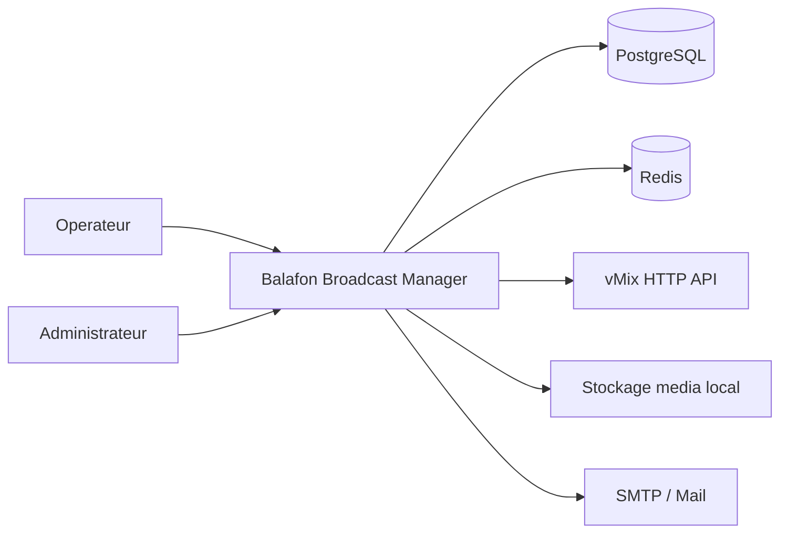
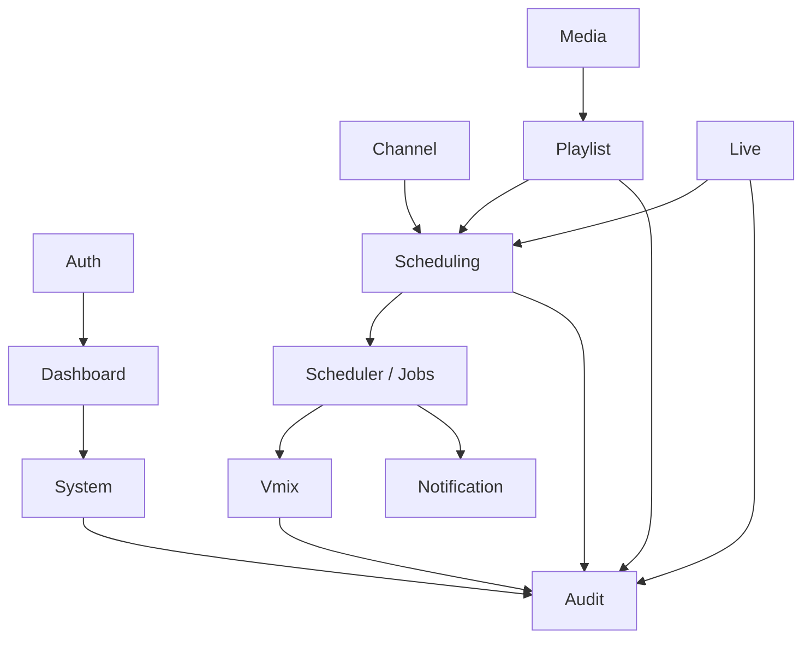
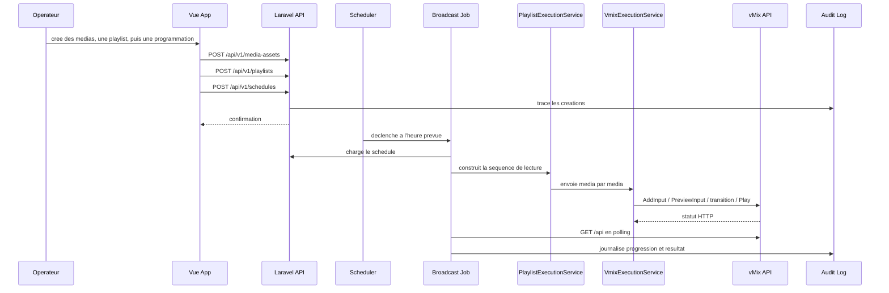
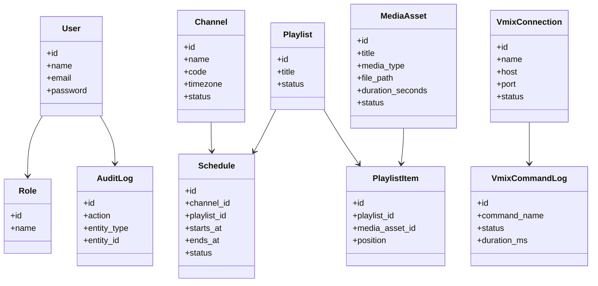

# Balafon Broadcast Manager - Architecture POC

## 0. Regles de cadrage obligatoires

Les conclusions de l'audit vMix deviennent des regles d'architecture obligatoires:

1. Balafon Broadcast Manager est la source de verite metier.
2. vMix est uniquement le moteur d'execution temps reel.
3. Les medias sont geres dans Balafon.
4. Les playlists sont gerees dans Balafon.
5. La programmation TV est geree dans Balafon.
6. L'automatisation est pilotee par Balafon via Scheduler + API vMix + polling XML.

Ces regles excluent toute architecture ou vMix devient le referentiel principal des medias, playlists ou programmes.

## 1. Vision

Balafon Broadcast Manager est une plateforme web de planification TV et de pilotage d'un moteur de diffusion vMix via son API HTTP.

Le POC doit permettre de:

- gerer les utilisateurs et leurs droits
- referencer des medias existants sans dupliquer les fichiers
- composer des playlists editoriales dans Balafon
- construire une grille TV plusieurs jours a l'avance
- declencher automatiquement la diffusion
- piloter vMix pour charger, lancer et superviser l'execution
- preparer et suivre les lives
- notifier les operateurs
- journaliser toutes les actions critiques

## 2. Principes d'architecture

### Stack

- Backend: Laravel 12, PHP 8.4
- Frontend: Vue 3, PrimeVue, TailwindCSS, Pinia, Heroicons
- Base de donnees: PostgreSQL
- Cache / queues / locks: Redis
- Environnement local: Docker

### Choix structurants

- DDD legere avec decoupage par domaines `app/Domains/*`
- services applicatifs pour l'orchestration
- repositories pour isoler l'acces aux donnees
- providers contractuels pour les integrations remplacables
- Jobs, Events, Listeners pour l'automatisation
- API REST versionnee `api/v1`
- journalisation technique et metier differenciee
- interface desktop-first pour usage regie TV
- design premium type SaaS broadcast 2026

### Hors perimetre MVP

Ne pas developper dans ce cycle:

- IA
- RAG
- assistant conversationnel
- generation automatique de programmes
- mediatheque complexe
- S3
- NAS
- gestion documentaire

## 3. Structure cible du projet

```text
app/
  Domains/
    Auth/
      Actions/
      DTOs/
      Models/
      Providers/
      Repositories/
      Services/
    Audit/
      Actions/
      Models/
      Repositories/
      Services/
    Channel/
      Actions/
      DTOs/
      Enums/
      Models/
      Repositories/
      Services/
    Dashboard/
      Queries/
      Services/
    Live/
      Actions/
      DTOs/
      Enums/
      Models/
      Repositories/
      Services/
    Media/
      Actions/
      DTOs/
      Enums/
      Models/
      Policies/
      Repositories/
      Services/
    Notification/
      Actions/
      DTOs/
      Services/
    Playlist/
      Actions/
      DTOs/
      Enums/
      Models/
      Policies/
      Repositories/
      Services/
    Scheduling/
      Actions/
      DTOs/
      Enums/
      Models/
      Policies/
      Repositories/
      Services/
    System/
      Actions/
      DTOs/
      Models/
      Repositories/
      Services/
    Vmix/
      Clients/
      DTOs/
      Enums/
      Models/
      Providers/
      Repositories/
      Services/
  Http/
    Controllers/
      Api/V1/
    Requests/
    Resources/
  Jobs/
  Events/
  Listeners/
  Policies/
  Providers/
database/
  migrations/
  seeders/
  factories/
resources/
  js/
    app/
      core/
      layouts/
      modules/
        auth/
        dashboard/
        media/
        playlist/
        scheduling/
        live/
        vmix/
        audit/
      pages/
      router/
      services/
      stores/
      ui/
tests/
  Feature/
  Unit/
  Architecture/
docker/
docs/
```

## 4. Bounded contexts

### Auth

Responsabilites:

- authentification
- gestion des roles et permissions
- securisation des endpoints

### Channel

Responsabilites:

- definition des chaines diffusees
- timezone et code antenne
- statut d'exploitation

### Media

Responsabilites:

- referencement de medias existants
- metadonnees minimales de diffusion
- validation de disponibilite
- recherche, filtre, categories et tags
- previsualisation rapide

### Playlist

Responsabilites:

- composition editoriale
- ordonnancement des medias
- calcul de duree totale
- preparation de sequence executable

### Scheduling

Responsabilites:

- construction de la grille TV
- programmation des playlists par chaine
- detection des conflits
- calcul des fenetres horaires

### Live

Responsabilites:

- gestion des evenements live
- placeholders live dans la grille
- suivi des depassements

### Vmix

Responsabilites:

- configuration des connexions vMix
- execution de commandes API HTTP
- lecture d'etat XML
- historique de commandes

### Notification

Responsabilites:

- alertes email
- notification d'erreurs d'automatisation
- notification de conflits de planification

### Audit

Responsabilites:

- journal des actions utilisateur
- journal des actions systeme
- correlation entre jobs, commandes vMix et contenus diffuses

### System

Responsabilites:

- diagnostic machine et environnement
- verification des prerequis applicatifs
- detection vMix et verification de connectivite
- collecte des signaux de sante systeme
- support du futur mode de licence

## 5. Couches applicatives

### Presentation

- controllers API REST
- form requests
- api resources
- Vue SPA

### Application

- services applicatifs
- actions metier
- DTOs
- orchestration de workflows

### Domain

- modeles Eloquent
- enums
- regles metier
- interfaces de repositories

### Infrastructure

- repositories Eloquent
- client HTTP vMix
- providers `RealVmixProvider` et `MockVmixProvider`
- Redis locks
- mailers
- scheduler / queue workers

## 6. Diagramme de contexte



## 7. Diagramme des modules



## 8. Diagramme de sequence - diffusion automatisee



## 9. Diagramme de classes simplifie



## 10. Entites principales

### 10.1 Auth

#### User

- id
- name
- email
- password
- is_active
- last_login_at
- timestamps

#### Role

- id
- name
- code
- timestamps

#### Permission

- id
- name
- code
- timestamps

### 10.2 Channel

#### Channel

- id
- uuid
- name
- code
- timezone
- description nullable
- status
- timestamps

### 10.3 Media

#### MediaAsset

- id
- uuid
- title
- description nullable
- media_type: program, movie, advertisement, jingle, live_placeholder
- file_path
- duration_seconds nullable
- status: ready, archived
- created_by
- updated_by
- timestamps

#### MediaCategory

- id
- uuid
- name
- slug
- timestamps

#### MediaTag

- id
- uuid
- name
- slug
- timestamps

### 10.4 Playlist

#### Playlist

- id
- uuid
- title
- description nullable
- status
- timestamps

#### PlaylistItem

- id
- playlist_id
- media_asset_id
- position
- duration_seconds nullable
- timestamps

### 10.5 Scheduling

#### Schedule

- id
- uuid
- channel_id
- playlist_id
- starts_at
- ends_at nullable
- status: draft, scheduled, on_air, completed, failed
- vmix_connection_id nullable
- notes nullable
- metadata jsonb
- created_by
- updated_by
- timestamps

#### ScheduleConflict

- id
- schedule_id
- conflict_type: overlap, missing_media, missing_vmix, invalid_duration
- severity: low, medium, high
- message
- resolved_at nullable
- resolved_by nullable
- timestamps

### 10.6 Live

#### LiveEvent

- id
- uuid
- channel_id
- title
- description nullable
- planned_start_at
- planned_end_at
- actual_start_at nullable
- actual_end_at nullable
- status: draft, prepared, ready, live, ended, cancelled, failed
- metadata jsonb
- created_by
- updated_by
- timestamps

### 10.7 vMix

#### VmixConnection

- id
- uuid
- name
- host
- port
- api_password nullable
- base_path default `/api/`
- timeout_ms
- is_active
- health_status: unknown, healthy, degraded, offline
- last_health_check_at nullable
- timestamps

#### VmixCommandLog

- id
- uuid
- vmix_connection_id
- schedule_id nullable
- live_event_id nullable
- command_name
- request_url nullable
- request_payload jsonb nullable
- response_code nullable
- response_body text nullable
- status: pending, success, failed
- duration_ms nullable
- error_message nullable
- executed_at
- timestamps

#### SystemDiagnostic

- id
- uuid
- machine_name nullable
- os_name
- os_version nullable
- vmix_detected
- vmix_version nullable
- vmix_api_reachable
- tested_endpoints jsonb
- local_ip nullable
- total_disk_bytes nullable
- free_disk_bytes nullable
- total_memory_bytes nullable
- available_memory_bytes nullable
- cpu_cores nullable
- cpu_load_percent nullable
- postgres_ok
- redis_ok
- scheduler_ok
- queue_workers_ok
- context jsonb
- checked_at
- timestamps

#### License

- id
- uuid
- license_key nullable
- license_type nullable
- customer_name nullable
- customer_email nullable
- machine_fingerprint nullable
- activated_at nullable
- expires_at nullable
- status
- metadata jsonb
- timestamps

### 10.8 Notifications

#### NotificationRule

- id
- code
- event_name
- recipients jsonb
- is_active
- timestamps

#### NotificationLog

- id
- notification_rule_id nullable
- event_name
- recipient_email
- subject
- status: pending, sent, failed
- sent_at nullable
- error_message nullable
- timestamps

### 10.9 Audit

#### AuditLog

- id
- uuid
- actor_id nullable
- actor_type: user, system
- action
- entity_type
- entity_id nullable
- context jsonb
- ip_address nullable
- user_agent nullable
- created_at

## 11. Relations

- `users` n..n `roles`
- `roles` n..n `permissions`
- `media_assets` n..n `media_tags`
- `playlists` 1..n `playlist_items`
- `media_assets` 1..n `playlist_items`
- `channels` 1..n `schedules`
- `playlists` 1..n `schedules`
- `channels` 1..n `live_events`
- `vmix_connections` 1..n `schedules`
- `vmix_connections` 1..n `vmix_command_logs`
- `schedules` 1..n `schedule_conflicts`
- `system_diagnostics` nourrit `dashboard` et `audit_logs`
- `users` 1..n `audit_logs`

## 12. Migrations initiales

Ordre recommande:

1. `create_users_table`
2. `create_roles_table`
3. `create_permissions_table`
4. `create_role_user_table`
5. `create_permission_role_table`
6. `create_channels_table`
7. `create_media_assets_table`
8. `create_media_categories_table`
9. `create_media_tags_table`
10. `create_media_asset_tag_table`
11. `create_playlists_table`
12. `create_playlist_items_table`
13. `create_live_events_table`
14. `create_vmix_connections_table`
15. `create_schedules_table`
16. `create_schedule_conflicts_table`
17. `create_vmix_command_logs_table`
18. `create_system_diagnostics_table`
19. `create_licenses_table`
20. `create_notification_rules_table`
21. `create_notification_logs_table`
22. `create_audit_logs_table`

### Contraintes de schema importantes

- UUID public sur les agregats exposes par API
- index sur `starts_at`, `ends_at`, `status`, `channel_id`
- index sur `executed_at` et `status` pour les logs vMix
- foreign keys explicites avec `nullOnDelete()` ou `cascadeOnDelete()` selon le besoin

### Regles de coherence a imposer

- `playlist_items.position` unique par playlist
- `schedules.playlist_id` obligatoire pour le MVP
- `ends_at > starts_at` si `ends_at` est renseigne
- `duration_seconds >= 0`
- `channels.code` unique
- `media_assets.file_path` doit etre valide sur le poste d'execution cible

## 13. Repositories et services

### Repositories

- `UserRepositoryInterface`
- `RoleRepositoryInterface`
- `ChannelRepositoryInterface`
- `MediaAssetRepositoryInterface`
- `PlaylistRepositoryInterface`
- `ScheduleRepositoryInterface`
- `LiveEventRepositoryInterface`
- `VmixConnectionRepositoryInterface`
- `VmixCommandLogRepositoryInterface`
- `AuditLogRepositoryInterface`

### Services applicatifs

- `AuthenticationService`
- `DashboardService`
- `MediaCatalogService`
- `PlaylistService`
- `SchedulePlannerService`
- `ScheduleConflictService`
- `BroadcastAutomationService`
- `PlaylistExecutionService`
- `VmixExecutionService`
- `LiveEventService`
- `VmixApiService`
- `VmixHealthCheckService`
- `NotificationService`
- `AuditService`
- `LicenseService`

### Providers contractuels

- `VmixProviderInterface`
- `NotificationProviderInterface`
- `StorageProviderInterface`

## 14. Endpoints REST initiaux

### Auth

- `POST /api/v1/auth/login`
- `POST /api/v1/auth/logout`
- `GET /api/v1/auth/me`

### Dashboard

- `GET /api/v1/dashboard/summary`
- `GET /api/v1/dashboard/on-air`

### Media

- `GET /api/v1/media-assets`
- `POST /api/v1/media-assets`
- `GET /api/v1/media-assets/{uuid}`
- `PUT /api/v1/media-assets/{uuid}`
- `DELETE /api/v1/media-assets/{uuid}`

### Playlist

- `GET /api/v1/playlists`
- `POST /api/v1/playlists`
- `GET /api/v1/playlists/{uuid}`
- `PUT /api/v1/playlists/{uuid}`
- `DELETE /api/v1/playlists/{uuid}`
- `POST /api/v1/playlists/{uuid}/items`
- `PUT /api/v1/playlists/{uuid}/items/reorder`
- `DELETE /api/v1/playlists/{uuid}/items/{itemUuid}`

### Scheduling

- `GET /api/v1/channels`
- `GET /api/v1/schedules`
- `POST /api/v1/schedules`
- `GET /api/v1/schedules/{uuid}`
- `PUT /api/v1/schedules/{uuid}`
- `DELETE /api/v1/schedules/{uuid}`
- `POST /api/v1/schedules/duplicate-day`
- `POST /api/v1/schedules/duplicate-week`
- `POST /api/v1/schedules/{uuid}/queue`
- `POST /api/v1/schedules/{uuid}/cancel`
- `GET /api/v1/schedule-conflicts`

### Live

- `GET /api/v1/live-events`
- `POST /api/v1/live-events`
- `POST /api/v1/live-events/{uuid}/prepare`
- `POST /api/v1/live-events/{uuid}/start`
- `POST /api/v1/live-events/{uuid}/end`

### vMix

- `GET /api/v1/vmix/connections`
- `POST /api/v1/vmix/connections`
- `POST /api/v1/vmix/connections/{uuid}/test`
- `GET /api/v1/vmix/connections/{uuid}/status`
- `POST /api/v1/vmix/commands`

### Audit

- `GET /api/v1/audit-logs`

## 15. Scheduler et automatisation

### Taches Laravel Scheduler

- verification chaque minute des `schedules` a lancer
- health check des connexions vMix toutes les 2 minutes
- detection des conflits de programmation toutes les 5 minutes
- relance des notifications en echec
- purge / archivage des logs selon retention

### Jobs

- `ProcessScheduledBroadcastJob`
- `PrepareLiveEventJob`
- `ExecuteVmixCommandJob`
- `CheckVmixHealthJob`
- `DetectScheduleConflictsJob`
- `SendNotificationJob`

### Mecanismes de fiabilite

- `withoutOverlapping()` sur les taches critiques
- locks Redis par `channel_id`
- retries exponentiels pour appels vMix
- circuit breaker simple sur connexions offline

## 16. Frontend Vue 3

### Architecture

- SPA admin consommatrice de l'API Laravel
- PrimeVue pour composants data-heavy
- TailwindCSS pour layout et theming
- Pinia pour l'etat
- Vue Router pour les modules

### Design system

- `AppLayout`
- `Sidebar`
- `Topbar`
- `StatCard`
- `DataTable`
- `StatusBadge`
- `Timeline`
- `SchedulerCalendar`
- `AlertCard`
- `ActivityFeed`
- `BroadcastStatusCard`
- `EmptyState`
- `LoadingState`

### Ecrans MVP

- login
- dashboard broadcast temps reel
- bibliotheque media
- playlists
- programmation TV
- gestion des lives
- configuration vMix
- audit trail

### Direction UI 2026

- dark mode par defaut
- support light mode
- palette noir profond / gris premium / accent rouge-orange
- densite de supervision type regie TV
- timeline broadcast visuelle et impressionnante
- experience comparable a un produit SaaS broadcast premium

## 17. Strategie de tests

### Unit

- services
- policies
- regles de planification
- providers vMix mockes

### Feature

- auth API
- CRUD media
- CRUD playlist
- CRUD programmation
- workflow live
- tests de permissions

### Automation

- tests `schedule -> playlist -> media -> vmix`
- tests de journalisation `audit_logs` et `vmix_command_logs`
- tests de reprise sur erreur

## 18. Docker local

Services recommandes:

- `app` PHP-FPM 8.4
- `nginx`
- `postgres`
- `redis`
- `node` ou service frontend build
- `mailpit`

Ports:

- app web `8080`
- vite `5173`
- postgres `5432`
- redis `6379`
- mailpit `8025`

## 19. Ordre final recommande

0. Validation API vMix
1. Auth + Roles
2. Media
3. Playlist
4. Scheduling TV
5. Detection Conflits
6. Automatisation Broadcast
7. Logs de Diffusion
8. Live
9. Notifications
10. Dashboard Temps Reel
11. Publicites
12. Jingles
13. Rapports
14. Assistant IA

## 20. Recommandation immediate

Le prochain cycle de developpement doit couvrir la chaine critique suivante:

1. referencement de medias existants
2. creation de playlists
3. programmation par chaine
4. detection de conflits
5. execution automatique via Scheduler
6. pilotage vMix via `RealVmixProvider`
7. journalisation complete

Le succes du MVP est atteint lorsque Balafon demontre sans intervention humaine:

`Media -> Playlist -> Scheduling -> Automation -> vMix -> Diffusion`
