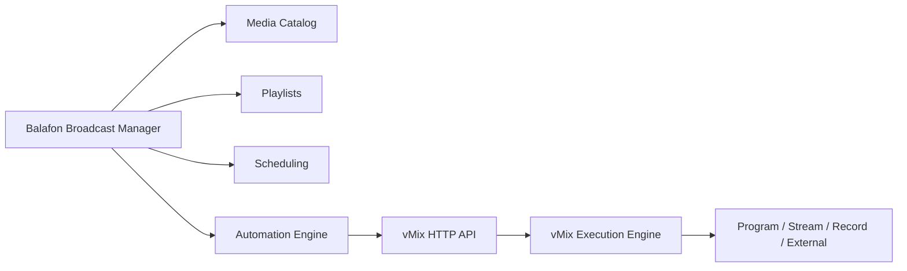
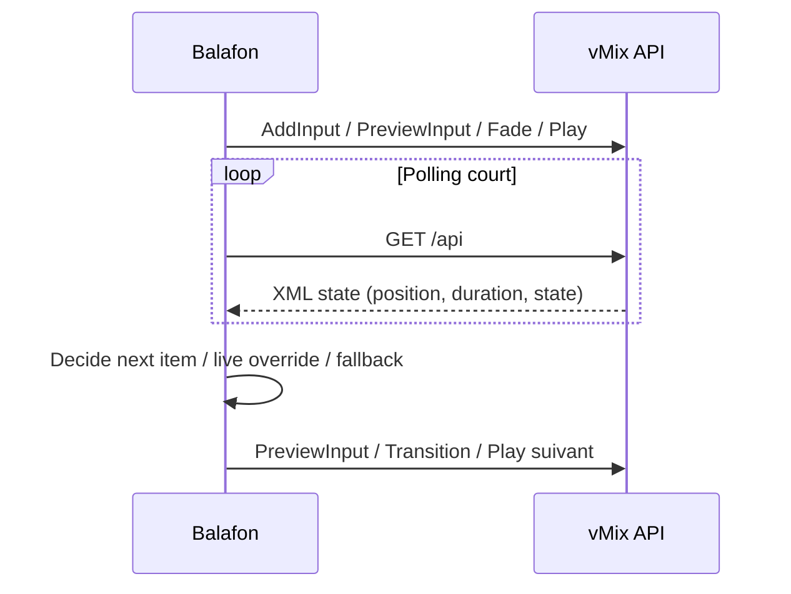
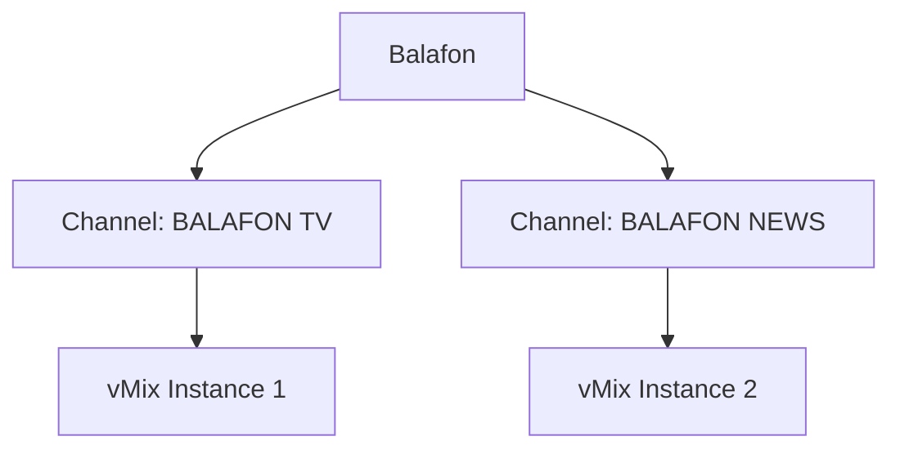

# Audit API vMix pour Balafon Broadcast Manager

Date d'audit: 2026-06-20

Contexte audite:

- vMix observe: `29.0.0.48`
- edition observee: `Trial`
- endpoint reel valide: `http://localhost:8088/api`
- communication Laravel -> vMix deja validee
- `Play Test` deja valide et trace dans `vmix_command_logs`

## 1. Resume executif

Conclusion directe:

- l'API HTTP vMix est une API de pilotage d'execution, pas une API metier complete de broadcast
- elle est tres bonne pour:
  - charger des inputs
  - commuter Preview/Program
  - piloter lecture / pause / position
  - piloter streaming / recording / external
  - modifier certains inputs, titres et listes
- elle est insuffisante pour:
  - gerer une mediatheque metier
  - gerer des playlists editoriales riches
  - porter seule une grille TV, de la planification et de l'automatisation broadcast

Decision d'architecture recommandee:

- Balafon Broadcast Manager doit gerer les medias, playlists, programmation, automatisation et supervision
- vMix doit rester le moteur d'execution temps reel et de diffusion

## 2. Sources auditees

### Instance reelle locale

Etat XML observe sur `http://localhost:8088/api`:

- `version`: `29.0.0.48`
- `edition`: `Trial`
- `preview`: `2`
- `active`: `1`
- `recording`: `False`
- `external`: `False`
- `streaming`: `False`
- `playList`: `False`
- `multiCorder`: `False`
- `fullscreen`: `False`
- `inputs_count`: `2`

Le XML expose aussi, pour chaque input, des attributs comme:

- `key`
- `number`
- `type`
- `title`
- `state`
- `position`
- `duration`
- `loop`

### Documentation officielle auditee

- HTTP API: `https://www.vmix.com/help29/DeveloperAPI.html`
- Shortcut Function Reference: `https://www.vmix.com/help29/ShortcutFunctionReference.html`

Point fondamental:

- toute fonction disponible dans les Shortcuts peut etre appelee via l'API HTTP
- l'API retourne `200` en succes et `500` en erreur
- si aucun parametre n'est fourni, l'API retourne l'etat courant au format XML

## 3. Nature reelle de l'API

vMix expose essentiellement:

1. une lecture d'etat globale XML
2. un systeme d'execution de commandes `Function=...`
3. un modele centre sur les `inputs`
4. des commandes utilitaires pour listes, titres, overlays, streaming, replay, scripts

Elle n'expose pas:

- un modele CRUD complet de ressources metier
- une API REST de playlists structurées
- des webhooks d'evenements
- une couche de planification TV

## 4. Inventaire API exploitable

Important:

- la liste officielle complete des commandes correspond a la `Shortcut Function Reference`
- pour Balafon, l'inventaire utile est ci-dessous, regroupe par domaines fonctionnels

| Fonction | Description | Utilisable dans le projet | Remarques |
| --- | --- | --- | --- |
| `ActiveInput` | Envoie un input vers Program/Output | Oui | Base du pilotage antenne |
| `PreviewInput` | Envoie un input vers Preview | Oui | Prepare les transitions |
| `CutDirect` | Coupe un input directement sur Output sans changer Preview | Oui | Utile pour automation brutale ou fallback |
| `Fade` / transitions UI | Transition Program/Preview avec duree | Oui | Duree en ms via `Duration` |
| `AddInput` | Cree un input depuis `Type|Source` | Oui | Types doc: `Video`, `Image`, `Photos`, `Title`, `VideoList`, `Colour`, `AudioFile`, `Flash`, `PowerPoint` |
| `RemoveInput` | Supprime un input | Oui | Ne remplace pas un vrai CRUD media |
| `CreateVirtualInput` | Cree un virtual input depuis un input existant | Oui | Utile pour workflows de production avances |
| `MoveInput` | Change l'ordre d'un input | Oui | Cosmetic / organisation UI vMix |
| `ResetInput` | Reinitialise un input | Oui | Utile pour retour a un etat propre |
| `Play` | Lance la lecture d'un input | Oui | Valide reellement dans Balafon |
| `Pause` | Met en pause l'input | Oui | Pour videos/listes |
| `PlayPause` | Toggle lecture/pause | Oui | Utilisable mais moins previsible qu'une commande explicite |
| `Restart` | Relance un input depuis le debut | Oui | Important pour automation |
| `SetPosition` | Positionne la tete de lecture en ms | Oui | Base pour seek / resume |
| `SetRate` | Regle la vitesse de lecture | Oui | Utile sur certains workflows, pas central pour TV lineaire |
| `LoopOn` / `LoopOff` | Active/desactive la boucle | Oui | Pratique pour fillers, jingles et loops |
| `AudioOn` / `AudioOff` | Active/desactive l'audio d'un input | Oui | Base du mixage automatique |
| `SetVolume` | Regle le volume d'un input | Oui | Peut servir a des fades applicatifs |
| `SetText` | Modifie un champ texte de titre | Oui | Necessite `Input` + `SelectedName` ou `SelectedIndex` |
| `SetImage` | Modifie une image dans un titre | Oui | Bon pour lower-thirds et templates |
| `SetCountdown` / `StartCountdown` | Compte a rebours sur un titre compatible | Oui | Utile pour habillage live |
| `OverlayInputX` / `PreviewOverlayInputX` | Pilote overlays | Oui | Important pour habillages antenne |
| `ListAdd` | Ajoute un fichier dans un input List | Oui | Pas une playlist editoriale complete |
| `ListRemove` | Supprime un element de List par index | Oui | Fonctionne sur inputs de type liste |
| `ListRemoveAll` | Vide une List | Oui | Utile pour regeneration d'une liste technique |
| `ListPlayOut` | Lance un input List | Oui | Point cle si Balafon decide de pousser une `VideoList` dans vMix |
| `NextItem` / `PreviousItem` | Navigue dans une List | Oui | Utilisable pour execution technique |
| `AutoPlayFirstOn` | Joue automatiquement le premier item d'une List | Oui | Aide a l'automation locale vMix |
| `AutoPlayNextOn` | Enchaine automatiquement le prochain item d'une List | Oui | Tres important pour playlists techniques |
| `SelectPlayList` | Ouvre une playlist vMix par nom | Oui, avec reserves | Suppose une playlist deja presente et nommee dans vMix |
| `StartPlayList` | Demarre la playlist vMix ouverte | Oui, avec reserves | Peu de controle metier associe |
| `StopPlayList` | Arrete la playlist vMix courante | Oui | Limite au moteur playlist vMix |
| `NextPlayListEntry` | Va au prochain item d'une playlist vMix en cours | Oui | Pas de lecture structurée detaillee cote API |
| `PreviousPlayListEntry` | Revient a l'item precedent | Oui | Meme reserve |
| `StartStreaming` | Demarre le streaming | Oui | Peut cibler un stream specifique |
| `StopStreaming` | Arrete le streaming | Oui | Pas de statut fin par plateforme dans XML |
| `StartStopStreaming` | Toggle streaming | Oui | Moins robuste qu'un start/stop explicite |
| `StreamingSetKey` | Definit la cle RTMP custom | Oui, avec prudence | Permet une config partielle de diffusion |
| `StreamingSetPassword` | Definit le mot de passe stream | Oui, avec prudence | Plus orientee config technique |
| `StartRecording` | Demarre l'enregistrement | Oui | Simple et exploitable |
| `StopRecording` | Arrete l'enregistrement | Oui | Simple et exploitable |
| `StartExternal` | Demarre la sortie externe | Oui | Pour ecrans / sorties externes |
| `StopExternal` | Arrete la sortie externe | Oui | Brique de supervision |
| `ScriptStartDynamic` | Execute un script dynamique vMix | Oui, mais a limiter | Tres puissant, mais cree une dette d'exploitation |
| `ScriptStart` / `ScriptStop` | Lance/arrete un script nomme | Oui, mais a limiter | A utiliser si une logique doit vivre dans vMix |

## 5. Parametres API importants

### `Function`

- nom de la commande a executer
- toute fonction Shortcut est appelable via l'API

### `Input`

Peut designer un input:

- par numero
- par nom exact
- par GUID `key`

Recommandation Balafon:

- toujours privilegier le GUID `key` pour eviter les ambiguïtés de titre

### `Value`

Selon la commande, `Value` peut transporter:

- un chemin de fichier
- une couleur HTML
- une duree
- un texte
- une vitesse
- un nom de playlist

### `SelectedName` / `SelectedIndex`

Utiles surtout pour:

- titres classiques
- GT titles
- VideoList
- certains inputs a sous-elements

### `Duration`

- utile pour les transitions
- valeur en millisecondes

### `Mix`

- selection du mix
- `0` pour le main mix
- mixes supplementaires dependants de l'edition

### `Channel`

- surtout pour Replay
- valeurs du type `A`, `B`, `Current`

## 6. Gestion des medias

### Ce que l'API permet

Oui, l'API permet de:

- charger une video depuis un chemin disque via `AddInput` avec `Video|c:\...`
- charger une image, un audio, un PowerPoint, une liste, un titre
- supprimer un input charge via `RemoveInput`
- modifier certaines proprietes d'un input existant:
  - play/pause/restart
  - position
  - rate
  - loop
  - audio
  - titres / images internes de titres

### Ce que l'API ne fournit pas proprement

Elle ne fournit pas un vrai cycle CRUD de mediatheque:

- pas d'objet `media asset` metier
- pas de metadonnees editoriales standardisees
- pas de recherche API dans un catalogue
- pas de versioning des assets
- pas de tagging natif exploitable comme une mediatheque SaaS

### Reponse a la question media

Les medias doivent etre geres dans **Balafon Broadcast Manager**.

Justification:

- Balafon doit porter la verite metier des assets
- vMix doit seulement recevoir des chemins / inputs a executer
- l'API vMix est excellente pour charger et lire, mais pas pour gouverner la vie complete des medias

## 7. Playlists

### Ce que vMix permet

vMix expose deux mecanismes distincts:

1. `VideoList` / `List*`
2. `PlayList` / `SelectPlayList` / `StartPlayList`

### VideoList / List

Fonctions observees:

- `ListAdd`
- `ListRemove`
- `ListRemoveAll`
- `ListPlayOut`
- `NextItem`
- `PreviousItem`
- `AutoPlayFirstOn`
- `AutoPlayNextOn`

Conclusion:

- vMix peut jouer des listes techniques
- mais la structure metier reste pauvre

### PlayList vMix

Fonctions observees:

- `SelectPlayList`
- `StartPlayList`
- `StopPlayList`
- `NextPlayListEntry`
- `PreviousPlayListEntry`

Conclusion:

- vMix sait piloter une playlist existante
- l'API ne documente pas un vrai CRUD complet de playlist
- l'API ne retourne pas la structure detaillee d'une playlist via XML
- l'API ne fournit pas un modele editorial suffisamment riche pour Balafon

### Reponse a la question playlist

Les playlists doivent etre gerees dans **Balafon Broadcast Manager**.

Justification:

- Balafon doit porter l'ordre editorial, les regles, le statut, les validations et la traçabilite
- vMix peut executer une liste technique, mais pas servir de referentiel playlist central

## 8. Automatisation

### Ce que l'API permet de connaitre

Pour chaque input, le XML expose au minimum:

- `state`
- `position`
- `duration`
- `loop`

Cela permet de calculer:

- duree totale
- position courante
- duree restante `duration - position`

### Ce que l'API ne fournit pas

- pas de webhook fin de clip
- pas de callback natif "video terminee"
- pas de moteur d'evenements broadcast externe

### Strategie recommandee pour l'automatisation

La meilleure strategie pour Balafon est:

1. Balafon calcule la programmation
2. Balafon choisit l'asset ou la sequence a jouer
3. Balafon charge/pointe l'input vMix adequat
4. Balafon lance lecture / transition
5. Balafon poll l'etat XML a cadence courte
6. Balafon decide le passage a l'input suivant

### Option vMix-only partielle

Pour certains cas simples, un `VideoList` vMix avec `AutoPlayNextOn` peut enchainer localement.

Mais pour une chaine TV reelle, cette approche n'est pas suffisante car elle ne couvre pas bien:

- les priorites live
- les coupures manuelles
- les changements de grille
- la reprise sur incident
- la supervision centralisee

## 9. Live

### Ce que l'API permet

L'API permet:

- de commuter les inputs live sur Preview/Program
- de piloter des overlays
- de modifier des titres / countdowns
- de lancer / arreter le streaming
- de lancer / arreter l'external output

### Ce qu'elle ne fait pas seule

Elle ne fournit pas un modele metier `LiveEvent` complet:

- pas de notion de depassement planning
- pas de notion de conducteur live
- pas de notion d'etat editorial de l'evenement

### Depassement live

Le depassement doit etre detecte par Balafon, pas par vMix.

Strategie:

- Balafon stocke `planned_start`, `planned_end`
- Balafon lit l'etat vMix
- Balafon compare au planning
- Balafon declenche alertes / actions operateur

## 10. Streaming

### Ce que le XML expose

Le XML expose:

- `streaming` = actif ou non

### Ce que les commandes exposent

- `StartStreaming`
- `StopStreaming`
- `StartStopStreaming`
- `StreamingSetKey`
- `StreamingSetPassword`

### Ce qui n'est pas expose clairement

L'audit n'a pas confirme d'etat detaille par plateforme du type:

- statut YouTube specifique
- statut Facebook specifique
- qualite de connexion par destination
- erreurs precises par destination dans le XML standard

Conclusion:

- Balafon peut savoir si le streaming vMix est actif
- Balafon ne doit pas supposer qu'il connait l'etat detaille YouTube/Facebook uniquement via ce XML

## 11. Enregistrement

### Ce qui est disponible

- `StartRecording`
- `StopRecording`
- `StartStopRecording`
- XML: `recording`

Conclusion:

- le controle de l'enregistrement est simple et exploitable
- Balafon peut superviser l'etat d'enregistrement sans difficulte

## 12. Multi-instance

Oui, plusieurs instances vMix peuvent etre pilotees, mais pas comme un cluster unique.

Modele recommande:

- une connexion Balafon par instance vMix
- un host/port distinct par instance
- une supervision separee

Exemple:

- `BALAFON TV` -> `vmix-1:8088`
- `BALAFON NEWS` -> `vmix-2:8088`

Contraintes:

- pas de coordination native entre instances par l'API
- Balafon doit porter:
  - la table des connexions
  - les verrous d'execution
  - l'ordonnancement par chaine

## 13. Limitations identifiees

### Limitations API

- pas de webhooks natifs
- modele XML global, pas vrai REST resource-based
- peu d'objets metier persistants consultables
- playlists vMix peu auditables via API
- pas d'etat detaille de destination streaming dans le XML standard

### Limitations techniques

- forte dependance au polling
- forte dependance aux chemins de fichiers Windows
- attention aux noms d'inputs si on n'utilise pas les GUID
- comportement variable selon type d'input

### Limitations Trial

Constat certain:

- l'instance auditee est `Trial`

Constat non prouve dans le XML standard:

- le XML standard audite ne documente pas lui-meme les restrictions d'edition

Risque:

- il faut valider hors audit API les limites temporelles ou fonctionnelles de l'edition Trial avant un usage durable

### Limitations pour automatisation TV

- vMix peut executer, mais ne remplace pas un moteur d'automation broadcast
- l'automatisation complexe doit rester dans Balafon

## 14. Recommandations d'architecture

### Question 1 - Medias

Reponse: **A. Dans Balafon Broadcast Manager**

Justification:

- mediatheque metier
- metadonnees editoriales
- categories / tags
- gouvernance des chemins et disponibilites
- traçabilite applicative

vMix doit seulement:

- charger un asset
- le jouer
- le supprimer si necessaire

### Question 2 - Playlists

Reponse: **A. Dans Balafon Broadcast Manager**

Justification:

- les playlists vMix ne couvrent pas les besoins de gouvernance
- pas de CRUD API riche
- peu de supervision structuree cote API
- la playlist Balafon doit pouvoir alimenter soit:
  - des commandes input par input
  - soit une `VideoList` technique vMix comme mecanisme d'execution

### Question 3 - Strategie cible

Strategie recommandee pour BALAFON TV:

1. Balafon porte la verite metier:
   - medias
   - playlists
   - programmation
   - regles d'automation
   - alertes
2. Balafon prepare une sequence executable
3. Balafon envoie a vMix:
   - `AddInput` si necessaire
   - `PreviewInput`
   - transition
   - `Play`
4. Balafon poll le XML vMix
5. Balafon decide la suite:
   - input suivant
   - jingle
   - pub
   - fallback
   - live prioritaire

## 15. Diagrammes recommandes

### Separation metier / execution

### Boucle d'automatisation recommandee

### Multi-instance

## 16. Risques majeurs

- croire que vMix peut remplacer la mediatheque applicative
- croire que la playlist vMix suffit pour une grille TV complete
- sous-estimer le besoin de polling robuste
- coupler l'automatisation a des titres d'inputs instables au lieu des GUID
- laisser vivre trop de logique critique dans `ScriptStartDynamic`
- ne pas separer proprement playlists editoriales et listes techniques d'execution

## 17. Recommandation finale avant poursuite

Avant de poursuivre les modules metier:

1. garder vMix comme moteur d'execution
2. construire la mediatheque dans Balafon
3. construire les playlists dans Balafon
4. concevoir le scheduling et l'automation dans Balafon
5. utiliser vMix pour:
   - charger
   - commuter
   - jouer
   - streamer
   - enregistrer
   - afficher
6. reserver les playlists vMix et `VideoList` a des usages techniques, pas comme referentiel metier principal

## 18. Decision de cadrage

L'audit confirme que la suite logique des developpements doit etre:

- `Media` dans Balafon
- `Playlist` dans Balafon
- `Scheduling` dans Balafon
- `Automation` dans Balafon
- execution temps reel dans vMix

vMix ne doit pas devenir la source de verite metier.
